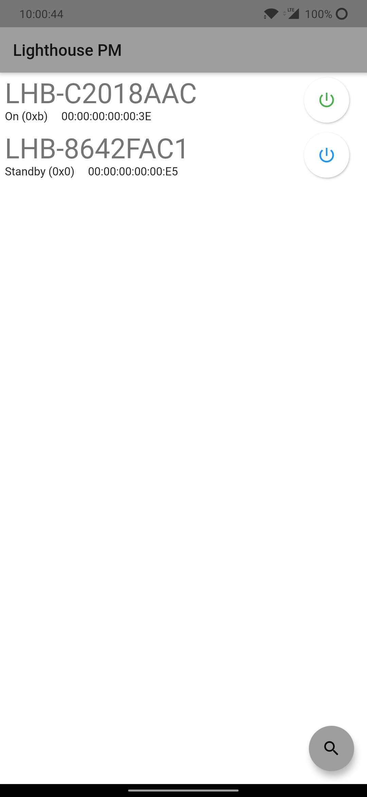

# Lighthouse Power Management

Power management app to control the Valve Index® lighthouses from your phone.

Inspired by [lighthouse-v2-manager](https://github.com/nouser2013/lighthouse-v2-manager) but that project is desktop only
And if your computer doesn't have a bluetooth adapter then it is useless. Sadly the Valve Index® doesn't provide it's bluetooth adapter
to the system and thus can't be used for that. Fortunately most phones do have bluetooth support, so I made this app to
easily change the power state of a Lighthouse.

**This project is still very alpha and sometimes the app needs to be restarted because it's gotten softlocked.**

**This project gives no warranty that you won't brick your lighthouses!**

It MOST probably won't actually brick your lighthouses, but I'm not liable in case that it does.
Since the method used to change the power state of the lighthouses is the same as the one that 
Valve uses it is very unlikely to actually brick the lighthouse.

If for whatever reason your lighthouse does get bricked, please [create an issue](./issues) so we can prevent other users from bricking theirs.

## Installation

Before you install this app, make sure that your phone supports bluetooth low energy (BLE).
Almost all phones made after 2013 support this.

### Sideload

After that you can grab the `APK` from the [releases](./releases) page and [sideload](https://www.howtogeek.com/313433/how-to-sideload-apps-on-android/) this onto your device.

### Google play

I first want the app to become a bit more stable (no/ rare softlocks) before releasing it to the 
PlayStore.

### iOS

Since the app is made in Flutter it should be able to run on iOS device with a minimal amount of
tweaking. I however don't have any Apple device so I can't test this.

If there is anyone who does want to pick this up and support that part then please look at [contributing](CONTRIBUTING.md).