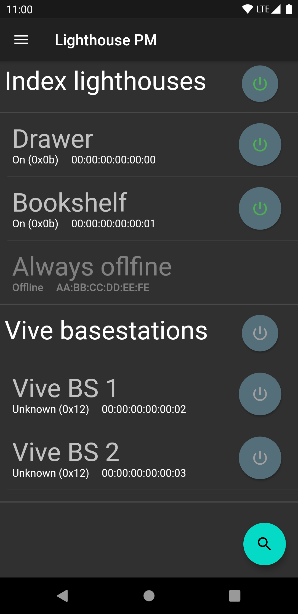

# Lighthouse Power Management

Power management app to control the Valve Index® lighthouses from your phone.

Inspired by [lighthouse-v2-manager](https://github.com/nouser2013/lighthouse-v2-manager) but that project is desktop only.
And if your computer doesn't have a bluetooth adapter then it is useless. Sadly the Valve Index® doesn't provide it's bluetooth adapter
to the system and thus can't be used for that. Fortunately most phones do have bluetooth support, so I made this app to
easily change the power state of a Lighthouse.

The app now also supports Vive Base stations, this is in Beta though.

**This project gives no warranty that you won't brick your lighthouses!**

It MOST probably won't actually brick your lighthouses, but I'm not liable in case that it does.
Since the method used to change the power state of the lighthouses is the same as the one that 
Valve uses it is very unlikely to actually brick the lighthouse.

If for whatever reason your lighthouse does get bricked, please 
[create an issue](https://github.com/jeroen1602/lighthouse_pm/issues) so we can prevent other users from bricking theirs.

## Installation

Before you install this app, make sure that your phone supports bluetooth low energy (BLE).
Almost all phones made after 2013 support this.

### System requirements

#### Android

 - Bluetooth low energy support (as stated above modern devices probably support it).
 - Android 4.4 (API level 19) and up.

### Google Play

**NOTE** The Google Play version may be behind by a version because of the approval process.

*Google Play and the Google Play logo are trademarks of Google LLC.*

### Sideload

Another way is to install the app using sideloading. Grab the `APK` from the [releases](https://github.com/jeroen1602/lighthouse_pm/releases) page and [sideload](https://www.howtogeek.com/313433/how-to-sideload-apps-on-android/) this onto your device.

### iOS

Since the app is made in Flutter it should be able to run on iOS device with a minimal amount of
tweaking. I however don't have any Apple device so I can't test this.

If there is anyone who does want to pick this up and support that part then please look at [contributing](CONTRIBUTING.md).

There has been a little bit of validating on the iOS version. So if you are able to and really want to you can try "[sideloading](https://beebom.com/how-to-sideload-apps-iphone-ios-10-without-jailbreak/)" it onto your iDevice.

## Building

Because the app uses generated code you will first need to run `flutter packages pub run build_runner build` or `flutter packages pub run build_runner watch` before the app can be build.

While the app is in development there may be changes to the local database, there will not be any migrations written unless it's between actual versions. So you may need to clear the app storage before some new features start working.

### Release build

Sometimes before you can create a release build you will need to assemble the Android component before an Android build can be created.
Run `./gradlew assemble` inside the `./android` folder before running `flutter build apk`/ `flutter build appbundle`
